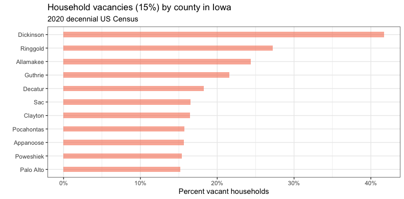
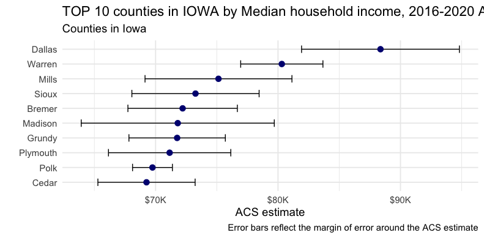
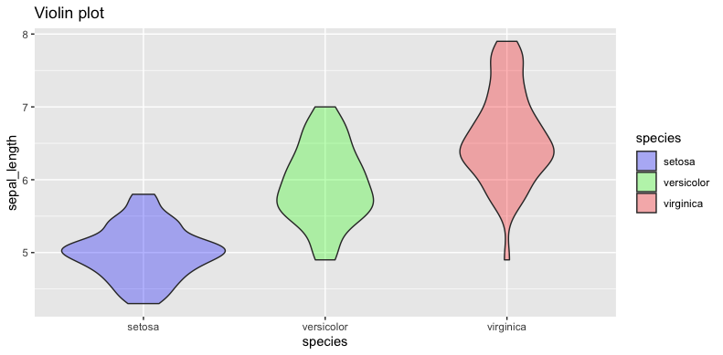

# Plot 1
I used the get_decennial function to obtain the census data at the Iowa county level, selected and renamed the total_households and vacant_households variables, and calculated their proportions, and selected the counties whose proportions were greater than 15%, and drew a bar graph for them, removed repeated characters.

# Plot 2
I used the get_acs function to get household income data for 2020 at the Iowa county level, sorted it from largest to smallest and selected the top 15 counties, plotted them in order from largest to smallest, and plotted them in The error term is added in the figure, and the repeated characters are also removed in order to beautify the figure.

# Plot 3
I used the read.csv function to get the data from GitHub, which is also available in R. In order to practice the read function, I chose to get it from GitHub. I used this data to practice my favorite violin plot, modifying its transparency and color choices.

The R code is [here](Assignment.R)
